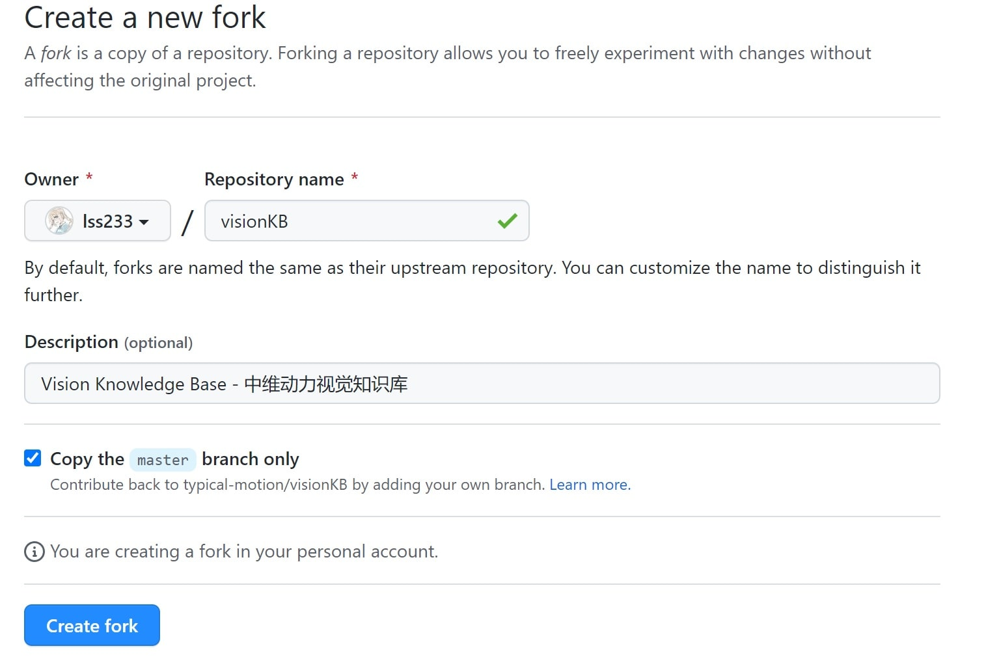
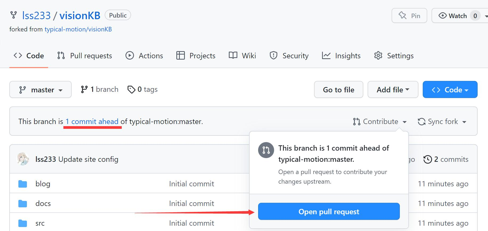
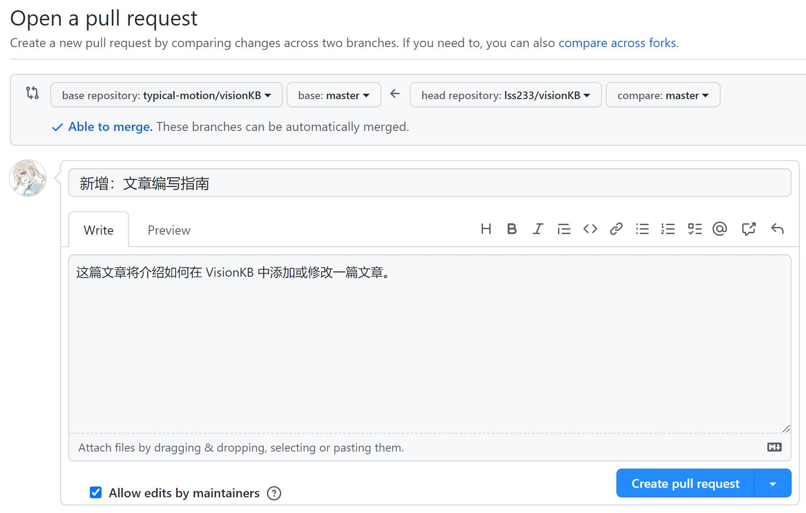

# 文章编写指南

这篇文章将介绍如何在 VisionKB 中添加或修改一篇文章。  

## 本地环境搭建
  
VisionKB 是基于 [Docusaurus 2](https://docusaurus.io/) 搭建的，使用 GitHub 进行协同创作，使用 Markdown 对文章进行编排。  

因此你将需要：
* 一个 Node.js 开发环境  
* Git 和 GitHub 账号
* 一个 Markdown 编辑器  

### 安装与配置 Node.js

Node.js 常用于 Web 前后端开发。   

你可以在 [这里](https://nodejs.org/zh-cn/) 查询最新的 Node.js 版本，通常情况下我们会选择用 长期维护版(LTS)。  

你可以在 [这里](https://mirrors.tuna.tsinghua.edu.cn/nodejs-release/) 下载 Node.js，并进行安装。

在 Node.js 安装好之后，我们需要再安装 [Yarn](https://yarnpkg.com/getting-started/install)。

Yarn 是一个 Node.js 的包管理器，它会帮我们下载 **Docusaurus** 所需要的第三方库。  

```bash
# 开启 Yarn
corepack enable
# 将 Yarn 切换到淘宝镜像站，提升下载速度
yarn config set registry https://registry.npmmirror.com/
```

## Git 仓库准备

为了避免大家的意外操作导致知识库文章丢失，请所有人以 Pull Request 的方式向知识库添加文章。  

对于**第一次**参与合作的同学，需要进行以下的准备工作。

**1. Fork 本项目**

你可以在 [这里](https://github.com/typical-motion/visionKB/fork) Fork 本仓库。

Fork 本仓库之后，你将会在自己的 GitHub 账号下有获得一个知识库仓库。在这里，我们将原来的仓库称为“主仓库” 或者“上游”。




**2. 下载项目到本地**

Fork 成功以后，你将会跳转到自己的仓库页面。  

你可以使用 Git 将仓库下载到本地。

```bash
# 别忘了把这里的地址换成你自己的
git clone https://github.com/lss233/visionKB
cd visionKB
# 添加主仓库地址
git remote add upstream https://github.com/typical-motion/visionKB
```

**3. 安装依赖**

项目下载成功之后，我们使用 Yarn 来安装依赖。

```bash
# 切换到 visionKB 目录
cd visionKB
# 安装依赖
yarn
```

**4. 启动 Docusaurus**

执行以下命令，启动 Docusaurus。

```bash
yarn start
```


启动成功之后，你可以在浏览器中访问 [http://localhost:3000/](http://localhost:3000/) 浏览本地版的知识库。

## 仓库同步

当主仓库有更新时，你可以通过执行下面这个命令来拉取主仓库的最新代码。  

```bash
git pull upstream
```
> 注意：在进行这个操作之前，先 commit 或 stash 你当前修改的内容

## 编辑并验证文章

VisionKB 中的每一篇文章都是一个 `.md` 格式的文件。    

你可以使用你喜欢的 Markdown 编辑器来写文章。  

当你启动了 Docusaurus 之后，你编写的内容会自动更新到网页中，刷新即可预览。

### 图片

图片可以放在图床上，或者放在 `static/img` 文件夹下。  

建议以你的文章标题建立一个专门的文件夹来存放图片。  

建议使用 JPEG 格式的图片，如果你的图片比较大，请先进行压缩。

## 保存并提交你的文章

当你完成了你的编辑之后，你可以使用 Git 将你的工作结果 commit 并 push。

```bash
git add 你的文件
git commit -m "新增：文章编写指南"
git push
```

需要注意的是，这里的 push 是将本地仓库的修改推送到**你自己的仓库**，而不是**主仓库**。

当你完成了 Push 之后，你就可以在 **你自己的仓库** 中看到下面这样一条消息。  



点击 **Open pull request**，填写你的修改内容，然后点击 **Create pull request**。  
 

然后等上游负责维护知识库的同学合并就好了！

**小提醒**

文章的合并是以分支合并的方式进行的。  

在正式合并前，如果你的文章还有一些问题需要改正，那么你可以直接继续往 **你自己的仓库** 提交新的代码。  

如果你的某一文章还未合并，但又想写新的文章，那么可以在 **一个新的分支** 来做这件事。
